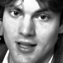
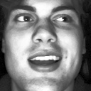

Danny Mikolay

Neural Networks Semester Project

# Part 1: Conceptual Design

### Introduction
The face recognition project aims to develop a neural network-based solution to extract facial features for use as biometric templates. These features will then be compared using metrics like Euclidean or cosine distance to determine whether two faces belong to the same person or different individuals. While face detection will be handled by existing packages (most likely MediaPipe), the feature extractor will be custom-built. The final objective is to recognize a specific face among a small set of other faces, including friends residing in Carroll Hall, with the option to implement real-time processing of webcam streams.

### Solution Overview
The solution will involve several key steps:

1. **Data Acquisition**: Obtain datasets containing images of faces for training, validation, and testing. In addition to public datasets like FRGC and BioID, images of friends residing in Carroll Hall can be included to personalize the recognition system and increase the relevance of the project.

2. **Preprocessing**: Preprocess the images to ensure uniformity and enhance the features relevant for recognition. This may involve tasks such as resizing, normalization, and augmentation to increase the robustness of the model. Specifically, images of friends can be collected in various lighting conditions and poses to mimic real-world scenarios.

3. **Feature Extraction**: Develop a neural network architecture to extract facial features or embeddings from the preprocessed images. This network will need to be trained using the acquired datasets, including images of friends, to learn discriminative features that are effective for face recognition.

4. **Training**: Train the feature extractor using the training dataset, optimizing its parameters to minimize the difference between embeddings of the same person and maximize the difference between embeddings of different individuals. Techniques like triplet loss may be employed to enforce this.

5. **Validation**: Validate the trained model using a separate validation dataset to assess its performance on unseen data and prevent overfitting. Adjustments to the model architecture or training parameters may be made based on validation results.

6. **Testing**: Evaluate the final model's performance using the test dataset, which should contain faces not seen during training or validation, including those of friends living in Carroll Hall. This step provides a realistic assessment of the model's ability to generalize to new faces.

7. **Deployment**: Optionally, develop a real-time version of the software that processes webcam streams for live face recognition. This may involve optimizing the model for inference speed and integrating it with appropriate hardware for efficient processing.

### Dataset Requirements
For effective training, validation, and testing of the face recognition model, the following dataset requirements are identified:

- **Training Set**: 
  - Contains at least 20 different samples per face for multiple individuals, including friends residing in Carroll Hall.
  - Should cover a diverse range of poses, expressions, lighting conditions, and occlusions to ensure robustness.

- **Validation Set**:
  - Consists of at least 10 different samples per face for individuals not present in the training set, including friends from Carroll Hall.
  - Helps monitor the model's performance during training and prevent overfitting.

- **Test Set**:
  - Comprises at least 10 different samples per face for evaluation, including faces not seen during training or validation and friends residing in Carroll Hall.
  - Assesses the model's generalization ability in real-world scenarios.

### Conclusion
In summary, the face recognition project involves developing a custom neural network for feature extraction from facial images, training it using diverse datasets, including images of friends living in Carroll Hall, and evaluating its performance on unseen data. By integrating images of friends into the dataset, the recognition system becomes more personalized and relevant to the project's context. Through this high-level solution, I aim to build an accurate and robust face recognition system capable of identifying individuals, including friends, in real-time scenarios.

# Part 2: Data Acquisition and Curation/Preprocessing

### The Collected Dataset
Feel free to look in the datasets folder in this repo to look at the images that I’ve downloaded and plan to use. They come from three main sources:

1. **[Dr. Libor Spacek’s Facial Images Database](https://cmp.felk.cvut.cz/~spacelib/faces)**
> This is my training set, particularly the faces96 archive. The images were collected in 2009. See the datasets folder to view the images that I have collected.

2. **[FEI Face Database](https://fei.edu.br/~cet/facedatabase.html)**
> This is my validation set; these images were taken between June 2005 and March 2006 at the Artificial Intelligence Laboratory of FEI in São Bernardo do Campo, São Paulo, Brazil.

3. **Personal Photos**
> I included 20 intentional photos of just my face in the training set along with 10 photos from my camera roll of me in various environments in the validation.

### Ideal Features of the Dataset
There were many factors that led me to choose these datasets over the others that I looked at:
- **Target Figures**: The training set includes 152 separate identities with 20 images of each, while validation includes 100 identities and 10 images of each. This is an ideal amount of identities and photos for this particular project.
- **Subject Attributes**: Both sets have a wide range of individuals varying in race and appearance. Training consists of 112 young men, 20 old men, and 20 women. While this would be harmful to facial recognition meant for both males and females, my project will only recognize my face, a young man, so it is ideal. Testing consists mostly of young men as well.
- **Background**: While the training photos do have similar backgrounds, there is variation and they are complex. This will allow for background to less likely influence the facial recognition and keep the identifier more fair. For validation, background is less important, but here they are the same.
- **Lighting**: The lighting is similar in the images, but there is variation. This will allow for users of the software to have varied lighting while their face is being analyzed without altering results. Once again, lighting differences are less important in the validation set, but the images are taken under similar conditions there.
- **Expression**: In both sets, those in the images have relatively expressionless faces with some variation. This is ideal because it creates a consistent baseline for analysis, free from the variability introduced by vastly different facial expressions, but it still covers a few minor changes by the user.

### Potential Setbacks of the Dataset
After deciding on my training set, I had a friend take 20 images of my face under similar conditions with my phone. While I did my best to create a similar environment to the images in the set, there are limitations that I will need to address in the preprocessing step:
- **Image Size/Resolution**: The photos in the training dataset are 196x196, while the photos from my phone are roughly 3000x4000 and from validation 360x220. I will need to resize the images for consistency when analyzing.
- **Camera**: The training dataset used an S-VHS camcorder to take photos, I used an IPhone 12 camera, and validation is unknown. This may cause discrepancies during image assessment.
- **Background**: The complex background for training is better than a simple color, but they are still very similar. I am going to have to find a way to remove the background on images in the dataset and those being analyzed in real time.
- **Position**: There is variation in the position of the faces in the image frame of the datasets. While this is helpful to simulate life-like situations, I will need to find a way to point out the face in an image before removing the background and beginning analysis.

### Training vs Validation vs Testing Sets
- **Training**: My training set is distinct from the others because it includes 20 images of each identity. It has more identities and more images. It also introduces enough variability in background, lighting, race, etc. The photos of myself included in the set are under similar conditions.
- **Validation**: My validation set is distinct because it has only 10 images of each identity. It also has limited background changes when compared to the training, so using it to train could be detrimental. It is important that it comes from a different source, camera, and size than training to prevent any bias. The photos of me in various environments are meant to simulate the various situations I would be in when using this facial recognition software.
- **Testing**: I plan to retrieve the testing dataset from real time processing of a webcam stream. It should also be able to recognize images being fed into it, but the real time webcam stream is the goal.

# Part 3: The First Solution With Results on Known Data

### Data Preprocessing

Before delving into the neural network architecture that I initially built for my facial recognition program, it's crucial to understand the preprocessing steps undertaken to prepare the data for facial recognition. I created a program to take in a directory containing several other directories with various images of the same person and perform several transformations on them (see process.py). It is crucial to pass in a directory containing other folders named according to the data kept in them. For example, directories in the training and validation datasets are labeled “danny” and contain images of me, while others are labeled 1 through 100 or 150 and contain images of person 1, 2, 3, etc. Every image undergoes several transformations to enhance their suitability for my specific CNN based facial recognition.

1. **Face Detection**: I start by using Google MediaPipe to detect faces within the images. This technology employs a deep learning-based approach to accurately identify facial regions. Once a face is detected, the background surrounding the face is cropped out, ensuring that only the facial region remains in the image. This step is vital as it eliminates irrelevant background information, focusing solely on the facial features necessary for recognition.

2. **Resizing**: Following face cropping, the images are resized to a consistent size of 128x128 pixels (while keeping the same aspect ratio). I chose this as it is small enough to reduce the computational burden on the network (especially when using a CNN), but still large enough to maintain an adequate resolution to extract facial features without too much loss. Standardizing the image size ensures uniformity across the dataset, facilitating consistent feature extraction by the neural network.

3. **Normalization**: Normalization is then applied to the resized images to standardize the pixel values between 0 and 255. This step ensures that the input data has a consistent pixel scale, preventing issues such as gradient explosion or vanishing gradients during training.

4. **Grayscale**: Next, the images are converted to black and white, reducing the dimensionality of the input data while preserving essential facial features. Grayscale images contain only intensity information, simplifying the network's computational burden without sacrificing discriminative power.

5. **Equalization**: Finally, histogram equalization is performed to enhance the contrast and brightness of the grayscale images. This technique redistributes pixel intensities to achieve a more uniform histogram, therefore highlighting facial features and improving their visibility.

These preprocessing steps are crucial to perform facial recognition with my CNN. By isolating facial regions, standardizing image sizes, normalizing pixel values, converting to grayscale, and enhancing contrast, the input data is optimized for effective feature extraction and recognition by the neural network.

### Neural Network Architecture:

The neural network architecture I first employed for facial feature extraction consists of several layers tailored to capture intricate facial features efficiently. A Convolutional Neural Network (CNN) serves as the backbone for feature extraction. The CNN comprises five convolutional layers followed by ReLU activation functions (see cnn.py), facilitating the extraction of hierarchical features from input images. Max-pooling layers are strategically placed to downsample feature maps, reducing computational complexity and enhancing translation invariance. Batch normalization layers are incorporated to stabilize and accelerate the training process by normalizing the input distributions. Following the convolutional layers, two fully connected layers are utilized for embedding generation, resulting in a feature vector of the desired size. This is essentially the same as the image classification CNN that we built in practical 2 after seeing how well that worked in that scenario I decided to use it as a starting point.

The loss function employed in this architecture is the triplet loss function, specifically designed for training on triplet samples (see triplet.py). Triplet loss works by selecting one image as the anchor, one positive example (the same person as the anchor), and one negative example (someone who is not the anchor). Triplet loss attempts to train the neural network in such a way that it learns to pull the anchor image closer to the positive image in the feature space, while pushing it further away from the negative image. Triplet loss ensures that the distance between anchor-positive pairs is minimized while maintaining a margin with anchor-negative pairs in the embedding space. This encourages the network to learn discriminative features for accurate facial recognition.

For optimization, the Adam optimizer is utilized, which efficiently adapts the learning rates for each parameter during training. Additionally, a learning rate scheduler is employed to adjust the learning rate based on the number of epochs, ensuring stable convergence and preventing oscillations during training.

### Achieved Accuracy:

The facial recognition system demonstrated (unusually) exceptionally high accuracy during training, achieving an accuracy rate of approximately 99.95% on the data that it was trained with, with little to no loss (0.0001). This accuracy was achieved in the first few epochs as well. However, upon evaluation on the validation set, the accuracy significantly drops, most likely indicating overfitting. This lower validation accuracy, revealed to me the model's inability to generalize to unseen data.

### Observations and Ideas for Improvement:

The discrepancy between training and validation accuracies seems to certainly indicate overfitting. While achieving high accuracy on the training set is indicative of the model's capacity to learn intricate facial features, the inability to generalize to unseen data poses a significant challenge that will require some changes.

To enhance the generalization capabilities of the neural network, I plan to implement several strategies and see how that changes results:

- **Model Complexity Reduction**: Considering the complexity of the 5 layer current neural network architecture, reducing the model's complexity may be beneficial, especially with my limited dataset. Streamlining the architecture by decreasing the number of parameters or layers can prevent overfitting and improve the model's ability to generalize to unseen data.

- **Data Augmentation**: By applying data augmentation techniques on my image sets with transformations like rotations, scaling, and flipping, I can introduce variations without altering labels. This process can force the model to learn more generalized features and become less reliant on specific training instances. By exposing the network to a wider range of scenarios during training, data augmentation improves generalization and broadens coverage of the input space, leading to more robust and reliable models.

- **Regularization**: Using regularization techniques (particularly dropout) can mitigate overfitting by imposing constraints on the model's parameters. Dropout layers can be integrated after the fully connected layers to prevent the network from relying too heavily on specific features, thus promoting more robust feature representations.

- **Hyperparameter Fine Tuning**: Experimenting with different hyperparameters, including learning rate, batch size, and margin value in the triplet loss function, can optimize the model's performance. Fine-tuning these parameters based on observations can lead to improved capabilities and enhanced accuracy on validation data.

In conclusion, while the current facial recognition system demonstrates impressive accuracy during training, addressing the issue of overfitting is key to enhancing its generalization capabilities. By incorporating some or all of the techniques described above, the neural network can be optimized to achieve better performance on both training, validation, and testing datasets.

# Part 4: Final Solution With Results on Unknown Data

### Alterations Made After Initial Solution

In part three, I had discussed several methods to reduce overfitting and allow my CNN to better generalize to unseen data. I attempted to implement three of these changes until I decided on the current configuration:

1. **Model Complexity**: My first attempt at solving the overfitting issue was to reduce the complexity of my model. I ended up reducing it all the way to just two convolutional layers and one fully connected latter at first. While this certainly reduced overfitting, it also drastically reduced actual accuracy. I kept experimenting with other changes and after finding better solutions I later switched back to my original CNN with five convolutional layers and two fully connected.

2. **Regularization**: I added more layers for batch normalization and included a dropout layer in between the two fully connected ones. The batch normalization layers add a bit of noise to the activations, introducing some randomness. The dropout layer randomly selects a fraction of the neurons and sets them to zero during training, preventing the network from relying too heavily on a single set of features. These changes were crucial to the success of my facial recognition program.

3. **Data Augmentation**: I artificially increased the size and diversity of my training dataset by applying a variety of transformations to the existing samples. Specifically, I used a random rotation of the images up to 10 degrees, a random color change (including shifts in brightness, contrast, saturation, and hue), and a random level of distortion. This generates new, more extensive samples that expose the model to more variation, and allow it to generalize better to unseen data.

### Testing Database

I essentially have two separate test databases, with one achieving significantly better performance than the other.

The first database is 10 images of me “in the wild,” or just out in a natural setting with varying angles, backgrounds, lightings, expressions, and more. These photos were just scraped from my camera roll and included in a dataset to be analyzed for facial embeddings and compared to the embeddings obtained for my face by the training model on the training dataset. The comparison was made through a program that used the trained neural network to compute image embeddings and calculate the Euclidean distance between those and the reference images of my face extracted the same way (compare.py).

One important note is that the threshold value was obtained from repeatedly testing on the training dataset to get results with a similar ratio of false positives to false negatives. Admittedly, it was not very scientific as I just kept variables to count when false positives or negatives occurred and calculated the ratio after comparisons. Nonetheless, I did achieve a threshold value that seemed ideal: it was not too strict so that images had to be exact matches, but it still was relatively reliable to detect my face and not others.

For this first database of images of myself in a natural setting, I ended up with a disappointing accuracy of about 55% correct. Using these images of myself were almost just as likely to get a positive result (classified as danny) as any random image of someone else.

My second database achieved much better results. This was done in a program where the user is recorded by the webcam, they press the spacebar whenever they want to take a photo, the photo is then processed and analyzed, and finally classified as “danny” or “not_danny” using calculations with the embeddings computed from the trained network. 

This second form of testing showed my network’s ability to actually recognize my face out of others. When I looked forward into the camera and kept my mouth closed, it correctly recognized me 80-90% of the time. Of course, adding variability in angles, expressions, etc led to a much lower classification accuracy (like in the first testing database). Another interesting observation was that it was about equally as likely to classify others correctly as well. I had several friends test the program and they were relatively consistently classified as “not_danny” (again at about an 80-90% rate). If you’d like to see an example of this, watch the video titled FacialRecognitionVideo.mov in the repository.

### Observations and Reasons for Performance Discrepancies

Upon evaluation of the facial recognition system on the test set, disparities in performance compared to the training and validation subsets are observed. In my programs case, these discrepancies most likely stem from a few factors:

- **Domain Shift:** The test dataset often exhibits subtle variations in data distribution, stemming from differences in image conditions, image quality, and demographic representation compared to the training and validation sets. These domain shifts introduce unseen challenges for the model. For example, it was trained on images taken with an older camera with lower quality. While I did my best to process the images to reduce the challenges caused by this, the difference probably still persists somewhere.

- **Limited Generalization to Unseen Scenarios:** Despite efforts to diversify the training data and incorporate augmentation techniques, the model may struggle to generalize effectively to unseen scenarios present in the test set. Unforeseen variations in facial angles, expressions, and lighting conditions pose challenges for feature extraction and classification capabilities, leading to increased error rates.

One way that I believe would have led to better results is altering the training dataset. If I were to have trained the model on a larger dataset with much more faces, each with a plethora of images of their face from all angles, lighting, and emotions, I feel like the testing images would have been classified much more accurately. The images that were not classified were almost always at an unusual angle or had me making a face in them. This also was present when testing with the webcam stream: every time I looked away from the camera, made a noticeable expression, or attempted in an area that was unusually light or dark, I would be incorrectly classified as “not_danny.”

To illustrate these discrepancies take a look at the following images after being processed:

Here is an example in the training data. All the training images were similar, with little change in angle and no change in lighting. I am focused on the camera and it is directly pointed at me.

|  | 
|:--:| 
| *Training Image Example* |
 

In this testing image, I was incorrectly negatively classified. The camera has an angle pointing down on my face, and my mouth is slightly open.

|  | 
|:--:| 
| *False Negative Example 1* |
 

In this testing image, I was also incorrectly negatively classified. The camera has an angle pointing up at my face, and I’m noticeably smiling and looking away from the camera. 

|  | 
|:--:| 
| *False Negative Example 2* |
 

In this testing image, I was correctly positively classified. The camera has a similar angle to the training data (pointed right at me), and I have minimal expression.

|  | 
|:--:| 
| *Correct Positive Example* |
 

